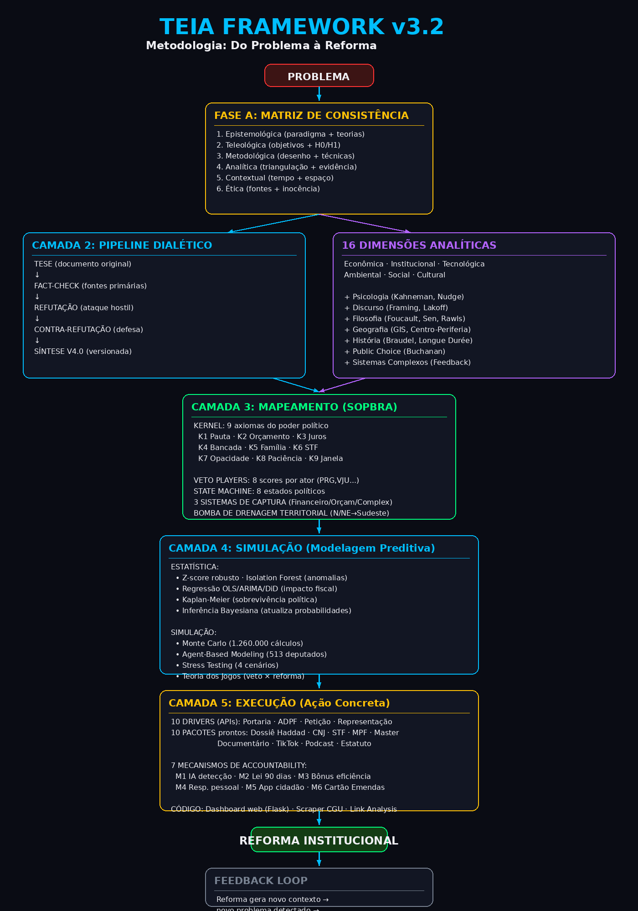

<div align="center">

# TEIA

### Centro de Estudos em Hacker Cultura Periférica

**Sistema operacional político brasileiro: diagnóstico, mapeamento, simulação e execução de reformas institucionais.**

</div>

---

## Diagrama da Metodologia



<details>
<summary>Ver versão em texto (ASCII)</summary>

```
╔══════════════════════════════════════════════════════════════════════════╗
║                    TEIA METODOLOGIA v3.2 — METODOLOGIA                     ║
║          Do Problema à Reforma: Pipeline de Investigação Integral        ║
╚══════════════════════════════════════════════════════════════════════════╝

                              ┌─────────────┐
                              │  PROBLEMA   │
                              │  (fenômeno) │
                              └──────┬──────┘
                                     │
                                     ▼
                    ╔═══════════════════════════════╗
                    ║   FASE A: MATRIZ DE CONSIST.  ║
                    ║   (Desenho Metodológico)      ║
                    ╠═══════════════════════════════╣
                    ║ 1. Epistemológica (paradigma) ║
                    ║ 2. Teleológica (objetivos/H0) ║
                    ║ 3. Metodológica (desenho)     ║
                    ║ 4. Analítica (triangulação)   ║
                    ║ 5. Contextual (tempo/espaço)  ║
                    ║ 6. Ética (fontes/inocência)   ║
                    ╚═════════════════╤═════════════╝
                                      │
                    ┌─────────────────┴─────────────────┐
                    │                                   │
                    ▼                                   ▼
    ╔════════════════════════╗              ╔════════════════════════╗
    ║  CAMADA 2: DIAGNÓSTICO ║              ║  16 DIMENSÕES ANALÍT. ║
    ║  (Pipeline Dialético)  ║◄────────────►║  (O que analisar)      ║
    ╠════════════════════════╣              ╠════════════════════════╣
    ║ 1. TESE (original)     ║              ║ ECONÔMICA              ║
    ║ 2. FACT-CHECK (fontes) ║              ║ INSTITUCIONAL          ║
    ║ 3. REFUTAÇÃO (hostil)  ║              ║ TECNOLÓGICA            ║
    ║ 4. CONTRA-REFUTAÇÃO    ║              ║ AMBIENTAL              ║
    ║ 5. SÍNTESE (V4.0)      ║              ║ SOCIAL / CULTURAL      ║
    ╚══════════╤═════════════╝              ║                        ║
               │                            ║ + Psicologia (Kahneman)║
               │                            ║ + Discurso (Framing)   ║
               │                            ║ + Filosofia (Foucault) ║
               │                            ║ + Geografia (GIS)      ║
               │                            ║ + História (Braudel)   ║
               │                            ║ + Public Choice        ║
               │                            ║ + Sistemas Complexos   ║
               │                            ╚════════════════════════╝
               ▼
    ╔═══════════════════════════════════════════════╗
    ║            CAMADA 3: MAPEAMENTO               ║
    ║           (Quem e como captura)               ║
    ╠═══════════════════════════════════════════════╣
    ║                                               ║
    ║  SOPBRA KERNEL (9 axiomas)                    ║
    ║  VETO PLAYERS (8 scores por ator)             ║
    ║  STATE MACHINE (8 estados políticos)          ║
    ║  3 SISTEMAS DE CAPTURA (financeiro/orçam/comp)║
    ║  BOMBA DE DRENAGEM TERRITORIAL                ║
    ╚═══════════════════╤═══════════════════════════╝
                        │
                        ▼
    ╔═══════════════════════════════════════════════╗
    ║            CAMADA 4: SIMULAÇÃO                 ║
    ║           (Modelagem Preditiva)                ║
    ╠═══════════════════════════════════════════════╣
    ║                                               ║
    ║  MODELAGEM ESTATÍSTICA:                       ║
    ║  • Z-score robusto (anomalias)                ║
    ║  • Isolation Forest (superfaturamento)        ║
    ║  • Regressão (OLS, ARIMA, DiD)                ║
    ║  • Kaplan-Meier (sobrevivência política)      ║
    ║  • Inferência Bayesiana (atualiza P)          ║
    ║                                               ║
    ║  SIMULAÇÃO:                                   ║
    ║  • Monte Carlo (1.260.000 cálculos)           ║
    ║  • Agent-Based Modeling (513+81 agentes)       ║
    ║  • Stress Testing (4 cenários)                 ║
    ║  • Teoria dos Jogos (veto×reforma)             ║
    ║                                               ║
    ║  DECISION TREE: Precisa Congresso?            ║
    ║  ├─ NÃO → Portaria/Resolução/Judiciário       ║
    ║  └─ SIM → Quem bloqueia? → Via Planalto (87%) ║
    ║                                               ║
    ║  + COALITION BUILDER (5 camadas de aliados)   ║
    ║  + THREAT MODEL (8 ameaças + contramedidas)   ║
    ╚═══════════════════╤═══════════════════════════╝
                        │
                        ▼
    ╔═══════════════════════════════════════════════╗
    ║            CAMADA 5: EXECUÇÃO                  ║
    ║           (Ação Concreta)                      ║
    ╠═══════════════════════════════════════════════╣
    ║                                               ║
    ║  10 DRIVERS (APIs institucionais)              ║
    ║  10 PACOTES (documentos de ação prontos)       ║
    ║  7 MECANISMOS DE ACCOUNTABILITY                ║
    ║  PRODUTOS DE CÓDIGO (dashboard, scraper, grafo)║
    ╚═══════════════════╤═══════════════════════════╝
                        │
                        ▼
                 ┌──────────────┐
                 │   REFORMA    │
                 │ INSTITUCIONAL│
                 │  (impacto)   │
                 └──────┬───────┘
                        │
                        ▼
              ┌─────────────────┐
              │  FEEDBACK LOOP  │
              │ Reforma gera    │
              │ novo contexto → │
              │ novo problema → │
              │ nova Matriz →   │
              │ novo ciclo      │
              └─────────────────┘
```

</details>

---

## O que é

O TEIA é um repositório de inteligência analítica que mapeia como o sistema econômico-político brasileiro captura recursos públicos e privados, identifica quem lucra com essa captura, quantifica como neutralizá-los, e fornece os documentos de ação prontos para execução.

Não é um manifesto. É um **sistema operacional político** — o **SOPBRA** (Sistema Operacional Político Brasileiro) — com 29 documentos técnicos, 1.260.000 simulações matemáticas, 10 documentos de ação prontos, 10 skills metodológicas, um metodologia de contribuidores, e tudo versionado em Git.

## Os números

| Indicador | Valor | Fonte |
|-----------|-------|-------|
| Juros da dívida pública (2024) | R$ 950,4 bi | Tesouro Nacional |
| Spread bancário médio | 28-30 p.p. | BCB SGS 20783 |
| Custo Brasil | R$ 1,7 tri/ano | MBC/CNI |
| Conformidade tributária | 1.501 horas/ano/empresa | World Bank |
| Emendas parlamentares | R$ 28,8 bi/ano (2024) | CGU |
| Cartórios | 13.233 unidades, R$ 31,4 bi/ano | CNJ |
| Probabilidade de prisão por desvio | <2% | estimado |
| Reeleição em cidades-cativo de emendas | 93-98% | dados eleitorais |

## Estrutura do repositório

```
TEIA/
│
├── SOPBRA_v0.1_arquitetura.txt              Kernel político (7 regras, 12 centros de poder)
├── SOPBRA_v0.2_sistema_funcional.txt        State machine, decision trees, threat model
├── SOPBRA_v0.3_cooptacao_contribuidores.txt Sistema de captação e retenção de pessoas
│
├── 01_ANALISE/              Pipeline dialético (tese → refutação → contra-refutação)
├── 02_MAPEAMENTO/           50+ parlamentares identificados por eixo de captura
├── 03_SIMULACAO/            Monte Carlo: 1.260.000 cálculos de probabilidade
├── 04_PLANO/                Plano com 20 ações, 18 metas SMART, 5 KPIs
├── 05_ACAO/                 9 documentos prontos para protocolar/publicar
├── 06_TERRITORIAL/          Fluxo de dinheiro público + privado entre regiões
├── 07_ACCOUNTABILITY/       7 mecanismos de mudança comportamental
├── 08_SINTESE_FINAL/        Qualidade de vida em 10 dimensões
│
├── skills/                  10 skills metodológicas reusáveis
├── README.md                Este documento
└── MANIFESTO_PROTOCOLOS.txt Índice master com hashes de integridade
```

---

## SOPBRA — Sistema Operacional Político Brasileiro

O SOPBRA é o núcleo do TEIA. É um metodologia que codifica COMO a política brasileira funciona na PRÁTICA — não como a Constituição diz que funciona, mas como realmente opera: quem tem poder, como flui o dinheiro, onde estão os pontos de alavanca, e como navegar o sistema para produzir mudança.

### 7 Camadas (como um SO)

| Camada | Função | Conteúdo |
|--------|--------|----------|
| **0 — KERNEL** | Regras reais do jogo | 9 axiomas imutáveis (pauta, orçamento, juros, bancada setorial, patrimônio familiar, judiciário, opacidade, paciência, janela) |
| **1 — DRIVERS** | Interfaces com o Estado | 10 drivers: executivo, legislativo, judiciário, MPF, TCU, CGU, BCB, TSE, estados, municípios |
| **2 — APIs** | Endpoints operáveis | `POST /portaria`, `POST /adi`, `POST /representacao`, `GET /pauta`, etc. |
| **3 — PROCESSOS** | Workflows | 10 processos: aprovar sem Congresso, bloquear lei, expor captura, instalar CPI... |
| **4 — PACOTES** | Documentos prontos | 9 PKGs do TEIA (dossiês, petições, roteiros) |
| **5 — MONITORAMENTO** | Dashboards | Orçamento, Selic, parlamentar, territorial, judiciário |
| **6 — SEGURANÇA** | Proteção | Anonimato, presunção de inocência, integridade, anti-retaliação |

### State Machine (8 estados políticos)

O SOPBRA monitora em qual estado o sistema político está e recomenda a ação:

| Estado | Descrição | Estratégia |
|--------|-----------|------------|
| 1. Status Quo | Estabilidade capturada | RECON silencioso + acúmulo |
| 2. Crise Aguda | Escândalo/CPI/PF | Entrar com PKG pronto + amplificar |
| 3. Janela Eleitoral | 6 meses antes de eleição | Cartão de Emendas + conteúdo |
| 4. Janela de Reforma | Pós-crise ou pós-eleição | Entregar proposta + Via Planalto |
| 5. Lua de Mel | Primeiros 6 meses de governo | Abordar ministros novos |
| 6. Bloqueio | Veto player domina | Bypass via Judiciário ou executivo |
| 7. Intervenção Judicial | STF/MPF age | Amicus curiae + representação |
| 8. Colapso | Crise sistêmica | Propor estabilização técnica |

### Threat Model (8 ameaças + contramedidas)

| Ameaça | Como o sistema revida | Contramedida |
|--------|----------------------|--------------|
| Captura regulatória | Febraban influencia BCB | OCDE + consulta pública |
| Judicialização defensiva | ADI contra reforma | Amicus curiae + base legal |
| Bloqueio de pauta | Motta não pauta | Via Planalto + narrativa |
| Manobra orçamentária | Cortam CGU/TCU | STF (orçamento constitucional) |
| Desinformação | "Vão confiscar poupança" | Fact-check imediato + fonte |
| Cooptação reversa | Oferecem cargo | Não aceitar (código de conduta) |
| Intimidação jurídica | Notificação extrajudicial | Fonte pública = exercício regular |
| Exaustão | Sistema espera até desistir | SOPBRA é sistema, não pessoa |

### Coalition Builder (5 camadas de aliados)

| Camada | Tipo | Exemplo |
|--------|------|---------|
| 1. Estrutural | Sempre a favor | Fintechs, cooperativas, MPF, CGU |
| 2. Tático | Momentaneamente | Oposição, ministro novo |
| 3. Neutro mobilizável | Pode ser convencido | Academia, OAB, think tanks |
| 4. Oposição divisível | Tem facção interna | Febraban (bancos vs Nubank) |
| 5. Irredutível | Não cooptável | Bancos top-5, oligarquias |

---

## Sistema de Contribuidores

O SOPBRA precisa de pessoas. O sistema de cooptação oferece o que a política tradicional não oferece: reconhecimento, propósito, comunidade e carreira — sem dinheiro sujo.

### 7 Perfis

| Perfil | O que faz | Motivação |
|--------|-----------|-----------|
| Analista | Dossiês, fact-checks, simulações | Impacto + publicação |
| Jurista | Petições, amicus curiae | Jurisprudência + causa |
| Comunicador | TikTok, podcast, carrossel | Audiência + conteúdo |
| Desenvolvedor | Dashboards, app, IA | Open-source + portfolio |
| Articulador | Conecta com centros de poder | Influência |
| Mobilizador | Pressão eleitoral e comunitária | Causa + pertencimento |
| Financiador | Custeia com integridade | Impacto mensurável |

### Níveis de Reputação

| Nível | Pontos | Benefícios |
|-------|--------|------------|
| Iniciante | 0-99 | Acesso ao grupo + skills |
| Contributor | 100-499 | Menção pública + certificado |
| Colaborador | 500-999 | Co-autoria + briefing técnico |
| Embaixador | 1000-2999 | Voto em conselho + dados exclusivos |
| Mantenedor | 3000+ | Commit rights + representação |

Ranking público mensal no GitHub. Transparência total.

---

## As 10 Skills

| # | Skill | O que faz |
|---|-------|-----------|
| 1 | `pipeline-dialetico` | Tese → fact-check → refutação → contra-refutação → síntese |
| 2 | `fact-check-economico` | Verificação contra BCB, STN, IBGE, RFB, TSE, CNJ |
| 3 | `mapeamento-veto-players` | Metodologia Tsebelis + nomes concretos + vulnerabilidades |
| 4 | `simulacao-monte-carlo` | 8 scores × 9 estratégias × 10.000 iterações |
| 5 | `redacao-juridica-advocacy` | Petição CNJ, amicus STF, representação MPF |
| 6 | `producao-conteudo-advocacy` | Documentário, TikTok, podcast |
| 7 | `diagnostico-territorial` | Bomba de drenagem financeira inter-regional |
| 8 | `accountability-publica` | 7 mecanismos de comportamento |
| 9 | `sistema-protocolo` | TEIA-AAAA-NNN + Git workflow |
| 10 | `posts-instagram-dados` | Carrossel dark/neon com Pillow + opencli |

---

## Documentos de Ação (prontos para execução)

| Protocolo | Documento | Destinatário | Status |
|-----------|-----------|--------------|--------|
| TEIA-2026-013 | Dossiê Técnico Haddad | Min. Fazenda | Pendente |
| TEIA-2026-014 | Petição CNJ (SERP) | Presidente CNJ | Pendente |
| TEIA-2026-015 | Amicus Curiae ADPF 854 | Min. Flávio Dino (STF) | Pendente |
| TEIA-2026-016 | Representação MPF | PGR | Pendente |
| TEIA-2026-017 | Dossiê Banco Master | Público | Pendente |
| TEIA-2026-018 | Roteiro Documentário | YouTube | Pendente |
| TEIA-2026-019 | Série TikTok (20 vídeos) | TikTok/IG | Pendente |
| TEIA-2026-020 | Podcast (5 episódios) | Spotify | Pendente |
| TEIA-2026-021 | Estatuto TEIA | Cartório | Pendente |

---

## Resultados da Simulação

### Probabilidade de aprovação dos 4 vetores (Combo Ótimo)

| Vetor | Status Quo | Combo Ótimo | Ganho |
|-------|-----------|-------------|-------|
| Gestão da Dívida | 88,2% | 97,7% | +9,5 p.p. |
| Spread Bancário | 61,2% | 85,1% | +23,9 p.p. |
| Desburocratização | 81,9% | 93,8% | +11,9 p.p. |
| Transparência | 88,7% | 97,2% | +8,5 p.p. |

**Combo Ótimo** = Via Planalto + Via CNJ + Aliança Judiciário + CPI Master + Narrativa Pública
**Custo**: R$ 6-12 milhões em 12 meses

### Estratégia mais eficaz

**Via Planalto (Lula/Haddad)**: P=87,1%, custo R$ 0, prazo 3-6 meses. Não precisa convencer 257 deputados — precisa convencer 1 ministro.

---

## Descobertas-chave

1. **A corrupção é vulnerabilidade, não força.** Atores com mais processo (Motta: 98,7%, Lira: 97,4%) são os MAIS fáceis de mover. Atores limpos e ideológicos (André Figueiredo: 8,4%) só se movem por argumento.

2. **70% das ações do plano não precisam de Congresso.** Saem via portaria (Tesouro), resolução (CMN/BCB) ou Judiciário (CNJ/STF).

3. **A bomba de drenagem financeira.** O dinheiro público que entra no N/NE via transferências é aproximadamente igual ao dinheiro privado que sai via sistema bancário. As transferências são neutralizadas pela drenagem.

4. **A pauta é o prêmio.** Quem controla o que NÃO chega a votação tem mais poder que quem vota.

5. **Não existe sistema que torne todos bons.** Existe sistema que torna o mau comportamento caro.

6. **O sistema político captura com dinheiro. O TEIA liberta com propósito.** Propósito se renova, dinheiro se gasta.

---

## Como usar

### Começar

```bash
# Clonar o repositório
git clone https://github.com/mouracleiton/TEIA.git
cd TEIA

# Ler a arquitetura do SOPBRA
cat SOPBRA_v0.1_arquitetura.txt      # kernel + drivers + APIs
cat SOPBRA_v0.2_sistema_funcional.txt # state machine + threat model
cat SOPBRA_v0.3_cooptacao_contribuidores.txt # como contribuir

# Ver documentos disponíveis
cat MANIFESTO_PROTOCOLOS.txt

# Ver skills disponíveis
ls skills/
```

### Executar uma ação

Cada documento em `05_ACAO/` tem destinatário e status. Para protocolar:

```bash
# Exemplo: petição ao CNJ
cat 05_ACAO/TEIA-2026-014_v1.0_peticao_cnj_serp.txt

# Preencher campos [CPF], [endereço] entre colchetes
# Revisar com advogado OAB
# Protocolar no CNJ (SAF/SUL, Quadra 5, Lote 1, Brasília/DF)
```

### Contribuir

```bash
# 1. Escolher um perfil (Analista, Jurista, Comunicador, Dev, etc.)
# 2. Ler o código de conduta em SOPBRA_v0.3
# 3. Escolher uma skill em skills/
# 4. Produzir contribuição
# 5. Commitar via Git

git add minha_contribuicao.txt
git commit -m "TEIA-2026-NNN: descrição da contribuição"
git push origin main
```

### Verificar integridade

Cada documento tem hash MD5 e SHA-256 no cabeçalho:

```bash
# Ver manifesto master
cat MANIFESTO_PROTOCOLOS.txt

# Verificar hash de um arquivo
md5sum 05_ACAO/TEIA-2026-013_v1.0_*.txt
```

---

## Roadmap

| Versão | Data | Marco |
|--------|------|-------|
| v0.1 | Jul/2026 | Arquitetura inicial (kernel, drivers, APIs) |
| v0.2 | Jul/2026 | Sistema funcional (state machine, threat model, playbooks) |
| v0.3 | Jul/2026 | Cooptação de contribuidores (7 perfis, reputação) |
| v0.4 | Ago/2026 | Drivers detalhados (fluxogramas, formulários) |
| v0.5 | Set/2026 | Dashboards operacionais (Python scripts) |
| v0.6 | Out/2026 | Playbooks testados em casos reais |
| v0.7 | Nov/2026 | Shell CLI (sopbra scan/exec/analise) |
| v0.8 | Jan/2027 | App móvel "Minha Cidade, Meu Dinheiro" |
| v0.9 | Mar/2027 | API pública REST |
| v1.0 | Jul/2027 | Release estável + comunidade ativa |

---

## Quem mantém

**Cleiton Moura** (@professorcinza) — analista geopolítico e econômico brasileiro. Criador de conteúdo em TikTok, Instagram e YouTube.

## Licença

Domínio público. Use, modifique, distribua.

---

<div align="center">

**O dinheiro da reforma virá do trabalho.**
**O instrumento de mudança é a gestão.**
**O sistema político captura com dinheiro. O TEIA liberta com propósito.**

</div>
